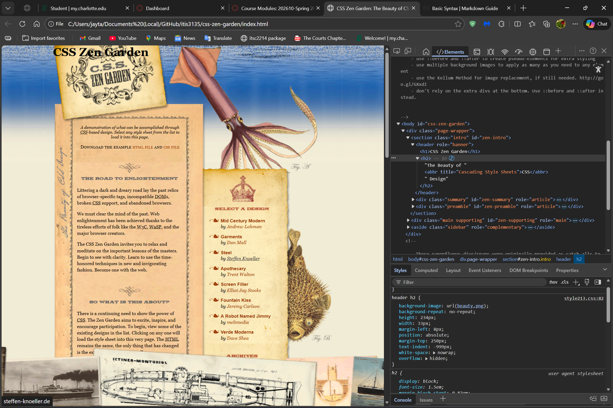
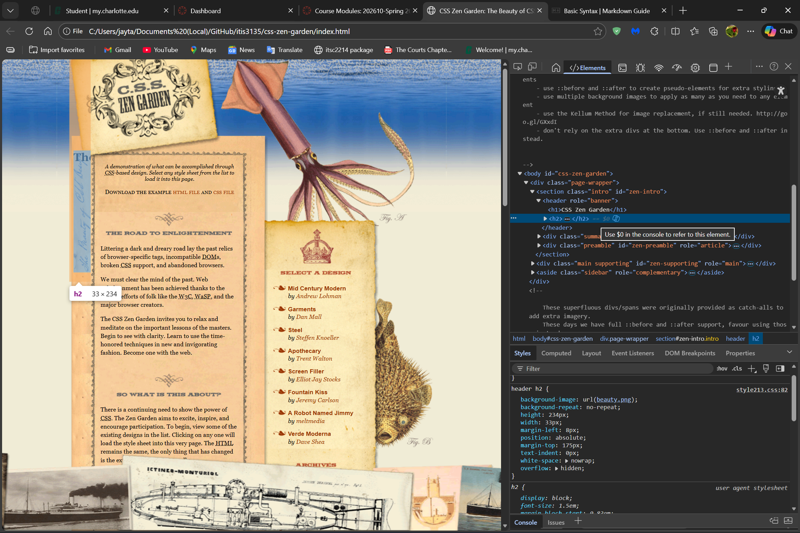
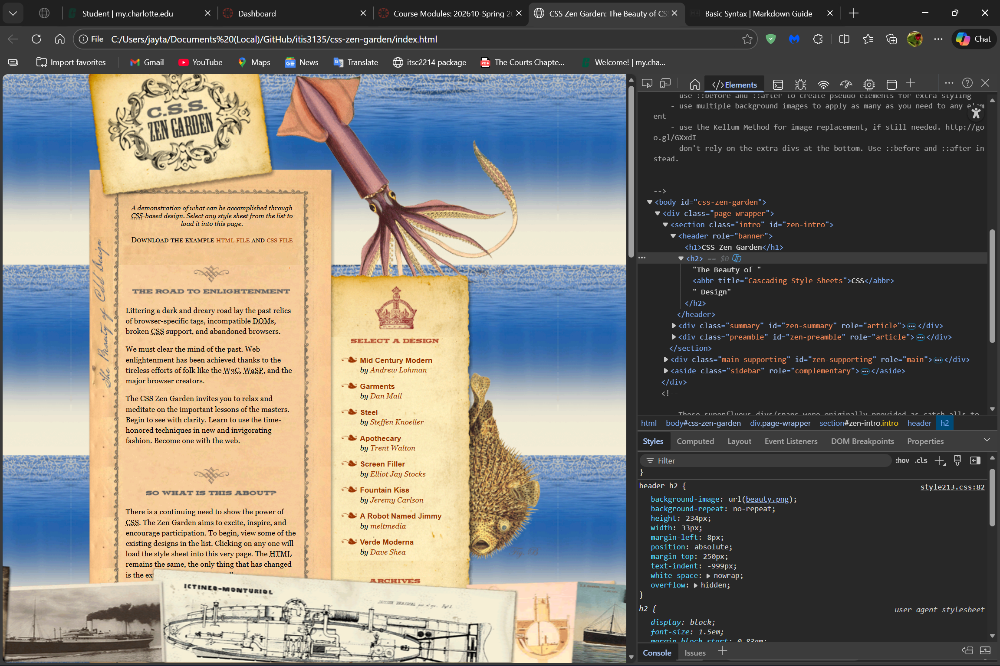
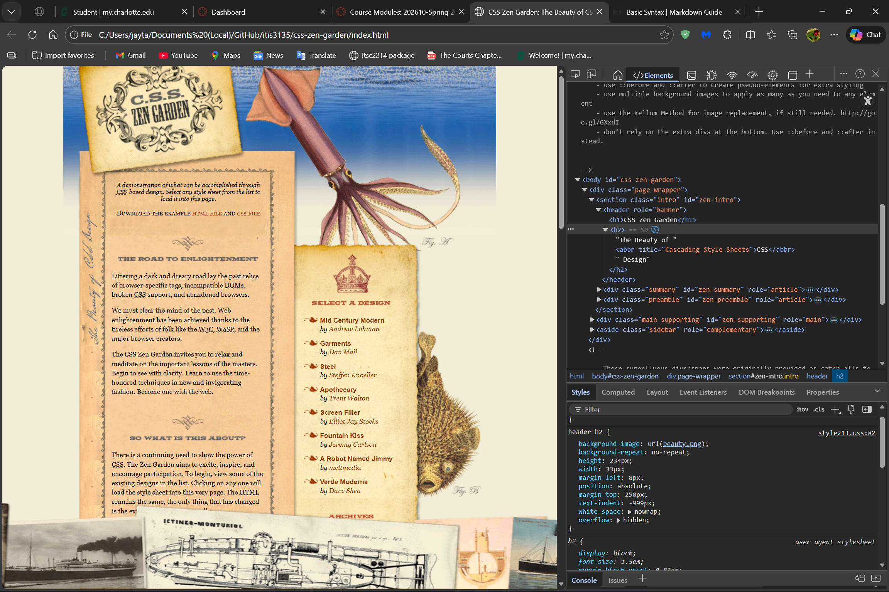

# In-Class Activity 6: Questions

## Study the html without CSS (remove style214.css or change the name slightly)

1. How many first level blocks (elements) are in the section with id "zen-intro"?

    >* There is only one first level block in the section with id "zen-intro".

2. The font size of the h1 and h2 elements seems the same. Use the develope tools to find out the actual font sizes.

    >* The font size of <code>h1</code> is <code>2**rem**</code> and the font ize of <code>h2</code> is <code>1.5**rem**</code>.

## Study the html with CSS (link to style214.css)

3. How are h1 and h2 (under header) styled?

    >* <code>h1</code> is styled with a height of <code>89**px**</code>, width of <code>219**px**</code>, top margin of <code>10**px**</code>, and is indented to the left.

    >* <code>h2</code> is styled with a height of <code>18**px**</code>, width of <code>200**px**</code>, top margin of <code>58**px**</code>, bottom margin of <code>40**px**</code>, and is indented to the right.

4. Compare the rules at Line 24 and Line 101 for text-align of the first p element. Which rule wins? That is, is the first p element "justified" or "centered"? (in zen-summary)

    >* The first <code>\
</code> in <code>.summary</code> is centered because the more specific <code>.summary p</code> rule overrides the global <code>p</code> rule.

5. What about the 3rd p element (the 1st p in zen-preamble)?

    >* The first <code>\
</code> in <code>.preamble</code> is justified because only the global <code>p</code> rule applies there.

(**Hint**: Use DevTools to help)

## Change the style file to "style213.css" and reload

6. What happened to the h1 element?

    >* The <code>h1</code> disappears visually because its text is pushed off-screen with <code>text-indent: -999**px**</code> and replaced entirely by the background image <code>title.png</code>.

7. Change the text-indent in h1 to Opx. What do you observe?

    >* Setting the <code>text-indent: 0**px**</code> makes the actual <code>h1</code> text visible, which then overlaps the decorative image.

8. What happened to the h2 element?

    >* The <code>h2</code> also disappears visually for the same reason as <code>h1</code>. Its text is hidden with <code>text-indent: -999**px**</code> and replaced by the tall vertical background image <code>beauty.png</code>.

9. Move the h2 so the end of the word "Design" aligns with the top of the summary description "A demonstration of what can be accomplished ... "

    >* To align <code>h2</code> to the top of the summary description I had to change the <code>text-indent: -999**px**</code> to <code>text-indent: 0**px**</code>, and the <code>margin-top: 250**px**</code> to <code>margin-top: 175**px**</code>.

10. Comment out Line 33 (/*CSS comment*/). What do you observe?

    >* With <code>repeat‑x</code>, the water graphic stretches horizontally across the entire top edge and the rest of the background is the default page color, but without <code>repeat‑x</code> the water graphic appears throughout the page and each photo is seperated by a small stretch of the pages default color.

11. On Line 33, change "repeat-x" to "no-repeat". What do you observe?

    >* When changing the <code>repeat-x</code> to <code>no-repeat</code> the image used is no longer stretched horizantally to cover the full width of the page but instead only the full width of the image or possible the full width of the image's section block.

12. Note the bottom figures do not scroll with the rest of the page. How is this achieved?

    >* The bottom figures stay fixed because <code>.extra2</code> uses <code>position: fixed; bottom: 0;</code>, which pins the image to the viewport instead of letting it scroll with the page.
