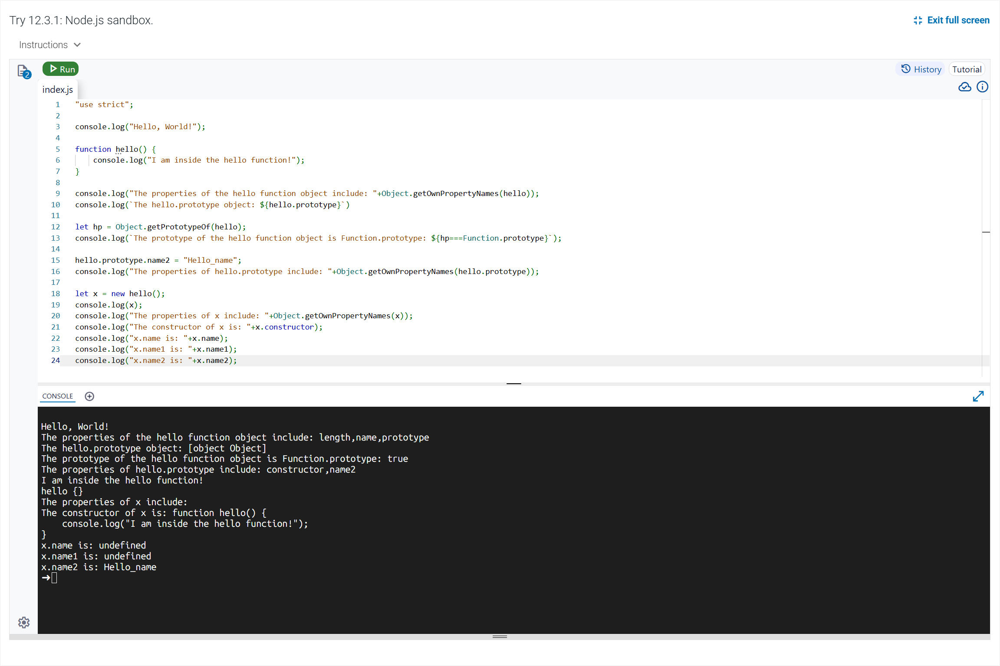
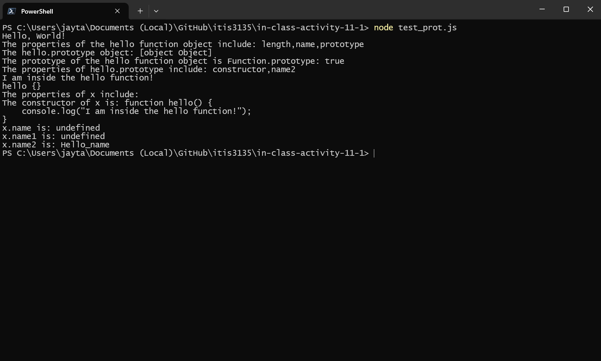

# In-Class Activity 11-1 Questions

## Questions

1. What does the following methods do?

    * Obiect.getOwnPropertyNames

    * Obiect.getPrototypeOf

> The Object.getOwnPropertyNames(obj) returns all the properties belonging directly to the object, including non-enumerable. However, it does **not** include properties from the prototype chain. While the Object.getPrototypeOf(obj) returns the object's **internal prototype**. That is, the object it inherits from.

2. What are the properties of the following objects? (Examine and revise the script to answer the
following questions)

    * The "hello" function object

    * The prototype of the "hello" function object

    * The "hello.prototype" object

    * The prototype of the "hello.prototype" object

    * The x object

    * The prototype of x object

    * The prototype of the prototype of x

> The hello function object has the properties "length", "name", and "prototype". The prototype of the hello function object is Function.prototype, which contains built-in function methods such as call and apply. The hello.prototype object initially contains the "constructor" property, and after modification in the code, it also includes the "name2" property. The prototype of hello.prototype is Object.prototype, which provides standard object methods like toString. The object x, created using new hello(), has no own properties. The prototype of x is hello.prototype, which means x can access "constructor" and "name2". The prototype of the prototype of x is Object.prototype.

3. Is "constructor" a direct (own) property of x? Where is this property defined?

> The constructor property is not a direct property of x; instead, it is inherited from hello.prototype, where it is originally defined.

4. Add a property "name1" to the "hello" function with value "Better name". What is the value of
x.name1 and x.name2? Why?

> When the property name1 is added to the hello function with the value "Better name", the value of x.name1 is **undefined**, while the value of x.name2 remains "Hello_name". This occurs because x only inherits properties from hello.prototype, not from the hello function itself.

5. Change the property name from "name1" to "name2". What is the value of x.name1 and x.name2? Why?

> When the property is changed so that name2 is added to the hello function instead of name1, the value of x.name1 remains **undefined**, and the value of x.name2 is still "Hello_name". This is because x.name2 comes from hello.prototype.name2, and properties added directly to the hello function are not inherited by objects created with new hello().

## Images

