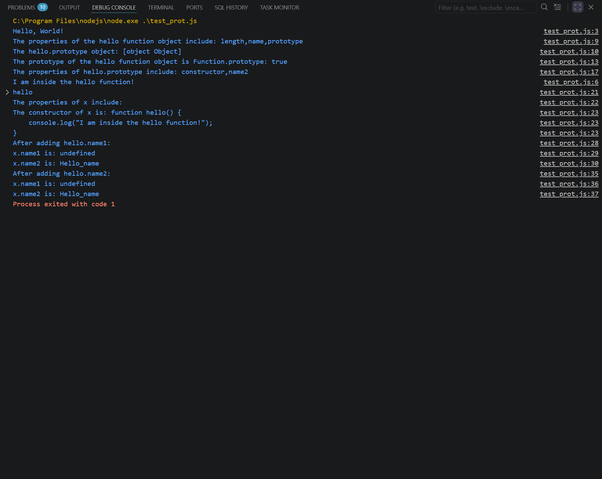

# In-Class Activity 11-2 Questions

## Instructions

1. Install node.js from [nodejs.org](https://nodejs.org/en).

2. Examine and revise the script to answer the following questions.

## Questions

1. What are the properties of the following objects?

    * The "hello" function object

    * The associated prototype of the "hello" function object
    
    * The "hello.prototype" object
    
    * The associated prototype of the "hello.prototype" object
    
    * The x object
    
    * The associated prototype of the x object

    * The associated prototype of the associated prototype of x

    * The "x.prototype" object

> The properties of the "hello" function object include length, name, and prototype, as shown by Object.getOwnPropertyNames(hello). The associated prototype of the "hello" function object is Function.prototype, verified using Object.getPrototypeOf(hello). The hello.prototype object contains the properties constructor and name2, since the script assigns hello.prototype.name2 = "Hello_name". Its prototype is Object.prototype. The x object has no own properties, so Object.getOwnPropertyNames(x) returns an empty array. Its prototype is hello.prototype, and the next prototype up the chain is Object.prototype. The x.prototype object is undefined because only functions have a prototype property.

2. Add a property "name1" to the "hello" function with value "Better name". What is the value of x.name1 and x.name2? Why?

> If hello.name1 = "Better name" is added, then x.name1 is undefined and x.name2 is "Hello_name", because instances like x only inherit from hello.prototype, not from the function object itself.

3. Change the property name from "name1" to "name2". What is the value of x.name1 and x.name2? Why?

> If hello.name2 = "Better name" is used, then x.name1 is undefined and x.name2 is still "Hello_name", because x gets name2 from hello.prototype, not from the hello function itself.

## Image

