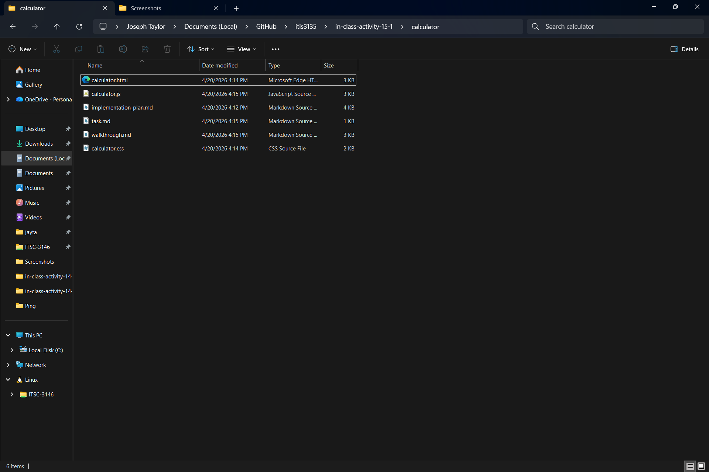
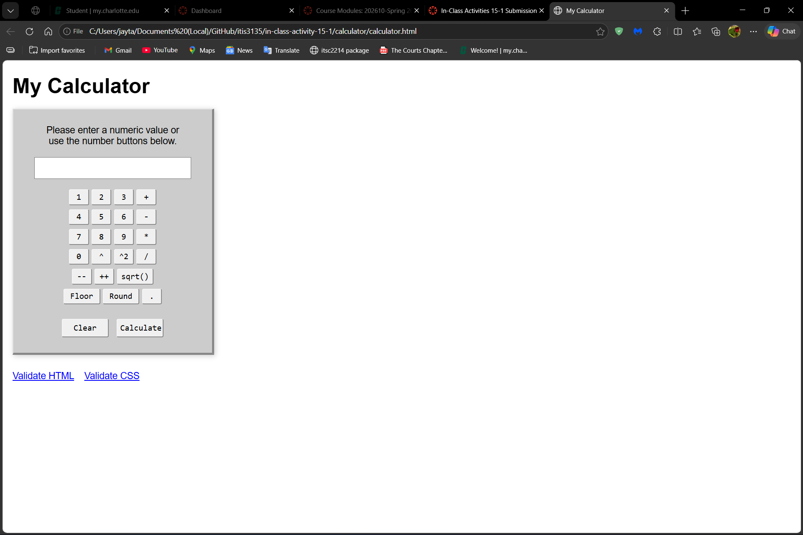

# In-Class Activity 15-1 Questions

## Instructions
<ul>
    <li>Download "Activity13 In-class Activities.zip" and make sure the app works</li>
    <ul>
        <li>In Vscode, use "Open in Default Browser". What do you observe? Why doesn't it work?</li>
        <li>In vscode, use "Open with live server" (install live server first). What do you observe? What is the URL in the browser?</li>
    </ul>
    <li>Download the image "calculator original.png" from Canvas</li>
    <li>Start a new Workspace</li>
    <li>Give a prompt to start an agent for web-based calculator development</li>
    <ul>
        <li>The interface should look like that downloaded image</li>
        <li>Use only the basic web languages &ndash; HTML, CSS, and JavaScript</li>
        <li>Make sure to start with an implementation plan</li>
    </ul>
    <li>Ask Antigravity to perform verification</li>
    <li>Check the codes in vscode editor</li>
    <ul>
        <li>Assess the quality of design</li>
    </ul>
    <li>Submit a screenshot of the calculator and all generated files</li>
</ul>

## Questions

* The two questions from above are repeated below, answer the questions underneath the repeated questions.

1. What do you observe? Why doesn't it work?

> When using "Open in Default Browser", an error message occurs and no team data is displayed. This happens because the browser is opening the file using the file://protocol, and the AJAX request is blcoked due to browser security (CORS) restrictions.

2. What do you observe? What is the URL in the browser?

> When using "Open with Live Server", the page loads correctly and the team data is displayed on the screen. The JSON file is successfully fetched and rendered.This works because Live Server runs a local web server, allowing AJAX requests to function properly. Here is the URL: [http://127.0.0.1:5500/Activity13-json.html](http://127.0.0.1:5500/Activity13-json.html).

### Examine Activity13.js

3. Line 5: Change the file to "team1.json", what do you observe?

> The app fails to load the data, and an error alert appears (e.g., 404 Not Found). This happens because team1.json does not exist, so the AJAX request cannot find the file.

4. Line 6: What does the property "beforeSend" do? Does fetch() allow the same?

> The beforeSend property runs a function before the AJAX request is sent. In this case, it displays "Loading..." inside the #team div to indicate that data is being fetched. Also, yes, fetch() can achieve similar behavior, but not with a built-in option like beforeSend. Instead, you manually run code before calling fetch() (e.g., updating the DOM before the request starts).

5. Line 13: What is the data type of "data"? In Developer Tools, set a breakpoint at Line 14 and examine the variable "data".

> The variable data is a JavaScript object. Since dataType: "json" is specified, jQuery automatically parses the JSON file into an object. It contains a property like teammembers, which is an array of objects.

6. Line 16: Change "append" to "html" and reload the app. What do you observe? Why?

> Only the last team member is displayed instead of all members. This happens because .html() replaces the existing content each time it runs, while .append() adds new content without removing the previous content.

## Antigravity for Calculator App

<figure>
    
    <figcaption>A screenshot of all the files created in the implementation of the web-based calculator.</figcaption>
</figure>
 
<figure>
    
    <figcaption>A screenshot of the final result when opening the web-based calculator.</figcaption>
</figure>
