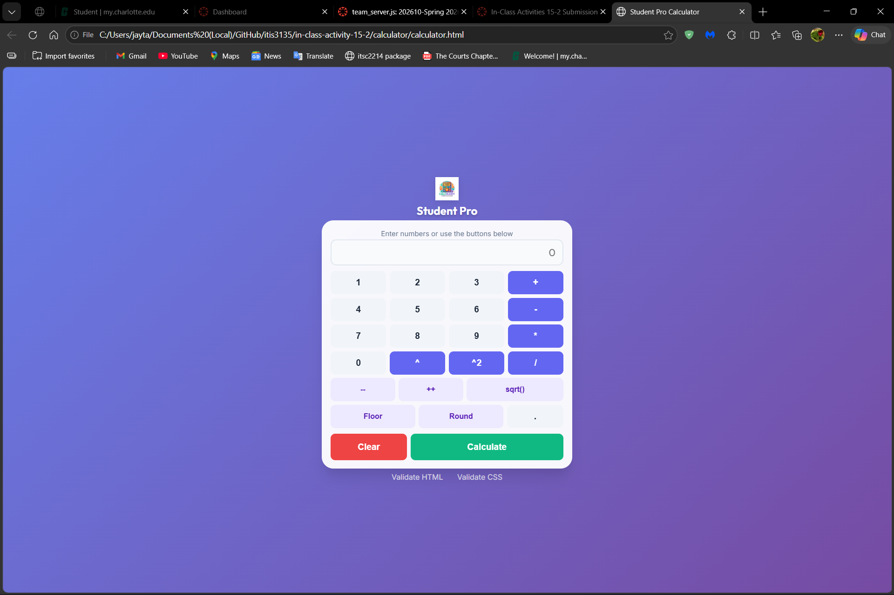

# In-Class Activity 15-2 Improved Calculator

## Instructions

<ul>
    <li>In Antigravity's "Agent Manager", submit the following prompts:</li>
    <ul>
        <li>Find an eye-catching logo and add it to the app</li>
        <li>The overall style of the calculator is quite boring. Please make calculator more appealing to young students</li>
        <li>Ensure that the cafculator always fits vertically in the window</li>
        <li>Prevent users from entering leading 0's, for example, 000010 should not be allowed, 000.5 should not be allowed, but 0.0005 should be fine.</li>
    </ul>
</ul>

## Final Result

<figure>
    
    <figcaption>A screenshot of the final result when opening the web-based calculator.</figcaption>
</figure>