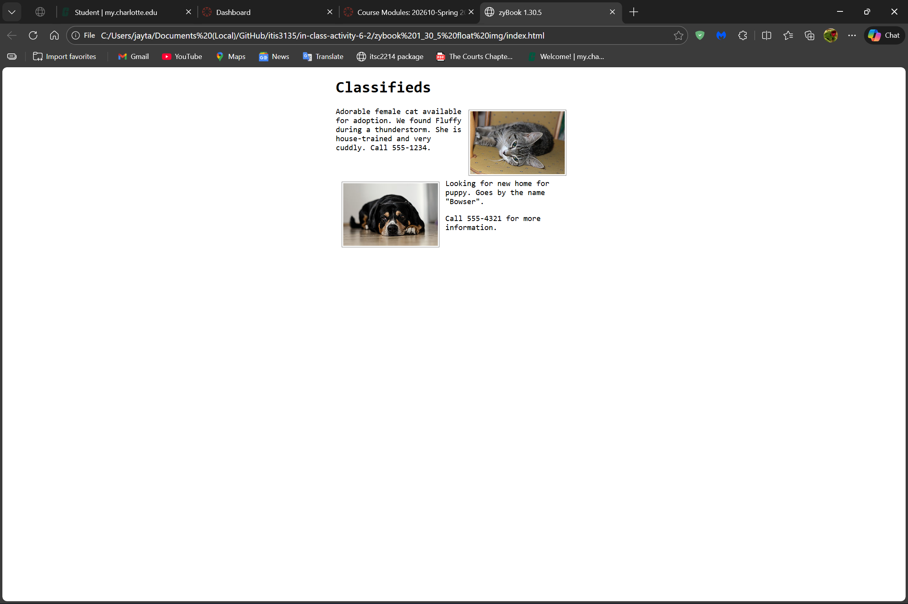
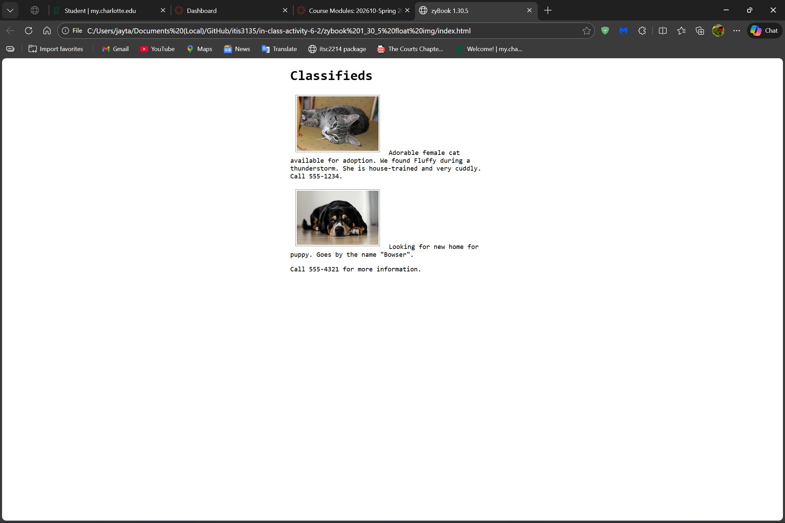
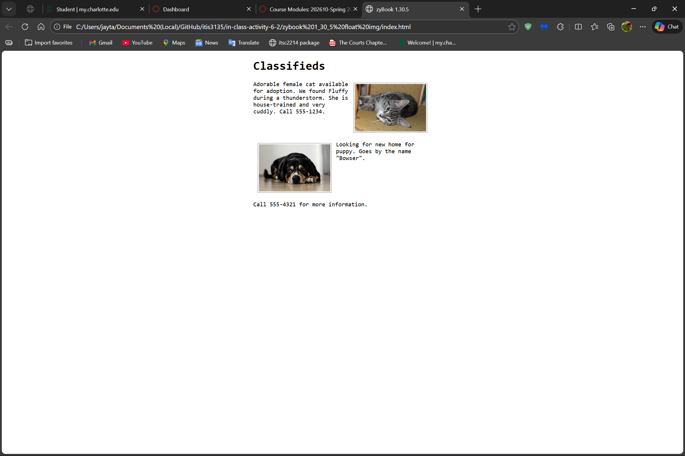
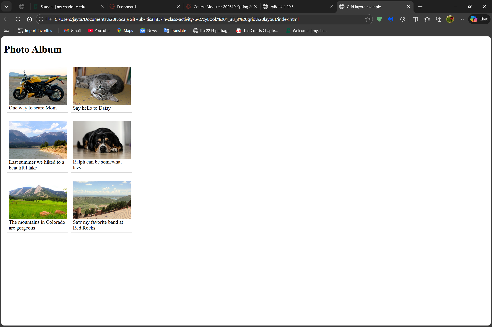
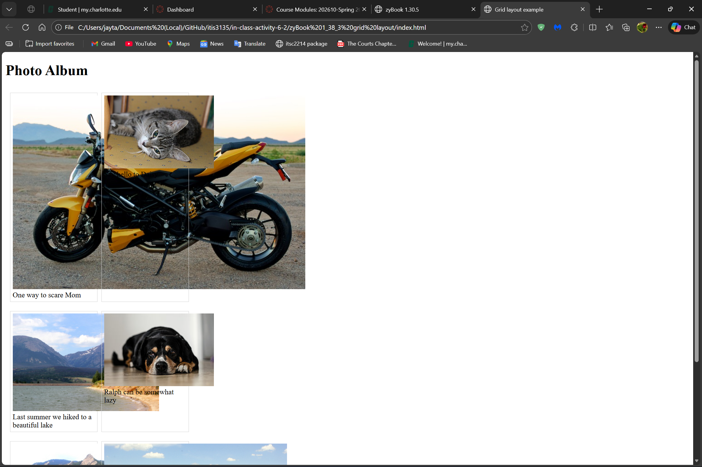
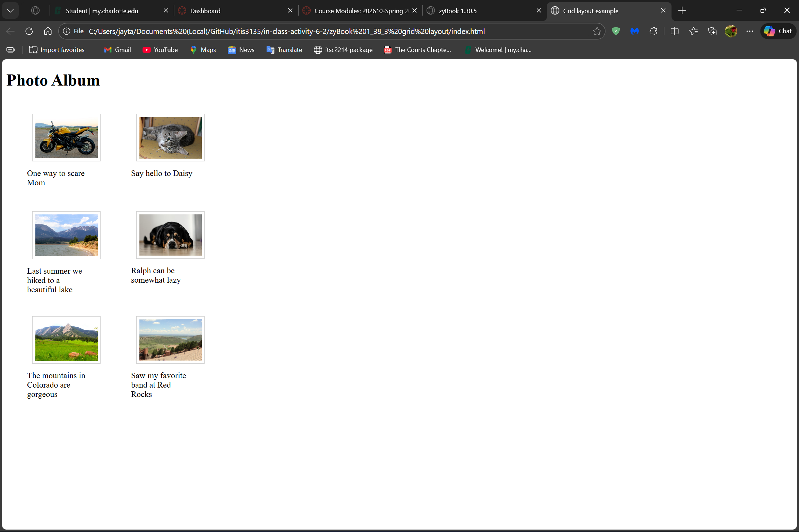
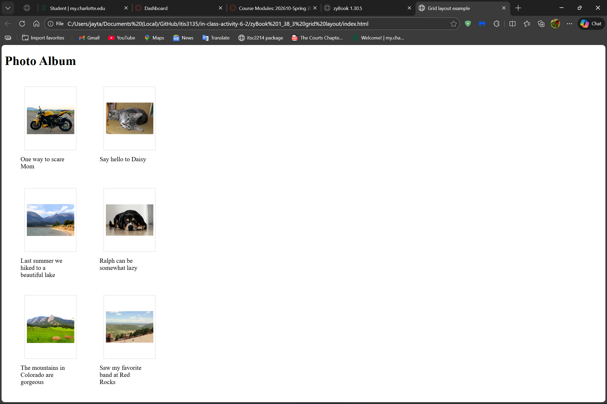
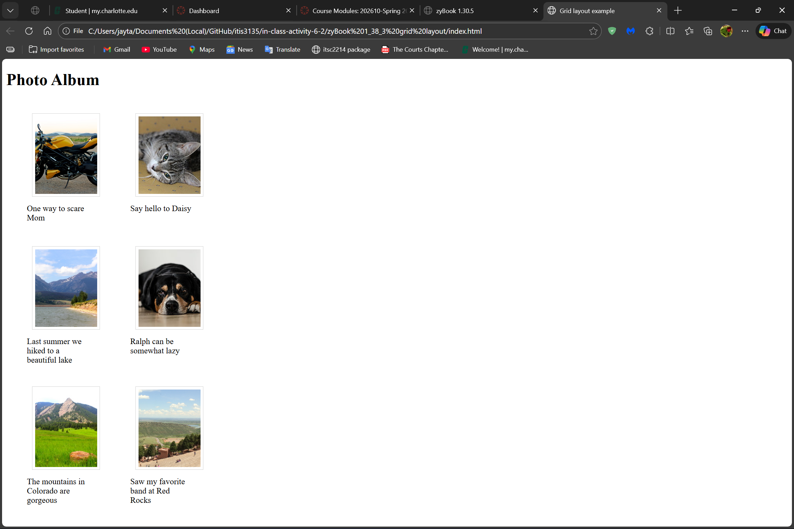
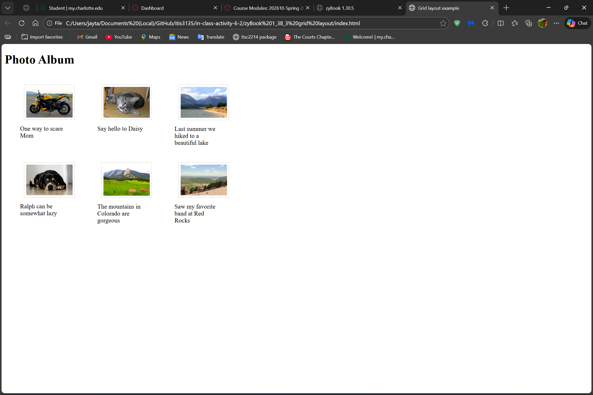
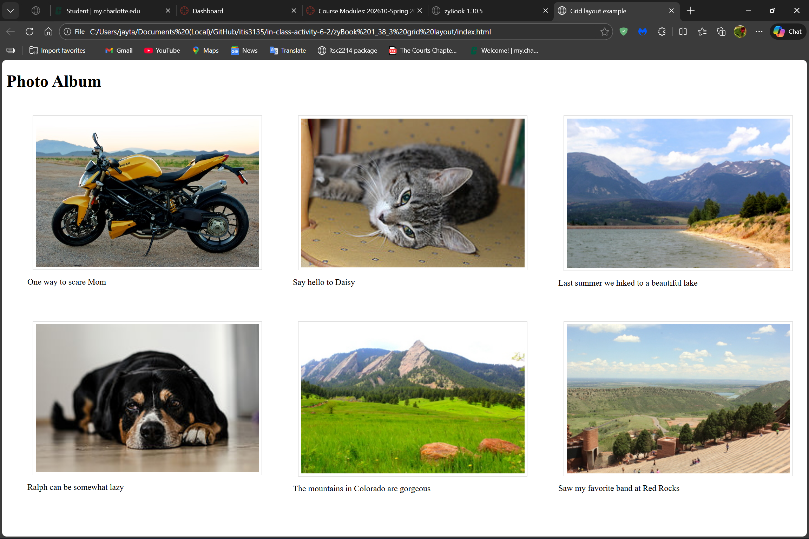

# In-Class Activity 6-2: Flex and Grid

## zybooks 1_30_5 float img

### Examine the code

Preview the web page "index.html" in your browser. Observe that this is the expected result in zyBook Section 1.30.5. And note in "style.css" that this is achieved with the "float" property.

### Change the code

1. Comment out the "float" related rules in "style.css" (Lines 14-24). Reload the page. What do you observe? (screenshot)

    >* Instead fo the first photo being right aligned it is now left aligned and all the text is now to the left and underneath the photos instead of being in-line and next to the photos.

 

2. Now add Flexbox layout to restore the web page. Now use the Grid layout instead. Make the webpage look as similar as possible. Do you see any challenges?

    >* Instead of the last <code>\<p\></code> element being in-line with the last photo, it is now underneath the last photo.

## zybooks 1_38_3 grid layout

### Examine the code

Preview the web page "index.html" in your browser. Compare the result with the expected result in zyBook Section 1.38.3. Make the browser window wider and narrower. What do you observe?

### Change the code

3. Revise the styling rule so the result keeps looking as close to the "Expected Webpage" in the book as possible regardless of the window size. Comment out the "flex" related rules in "style.css" (Lines 7-8). Reload the page. What do you observe? (screenshot) Why?

    >* In the *first screenshot* the images are now closely packed together because of the change in the grid spacing rules. After commenting out the <code>"flex"</code> related rules in "**style.css**", the images become enlarged and out of place (*see second screenshot*). This is because each image as its own sizing which implies that each image is going to be different in length and width, and without the <code>"flex"</code> rules there is nothing to keep the images and their text elements in their respected locations.

 

4. Clearly, the Flexbox fixes this problem. Are there other ways to fix this problem?

    >* Yes, set the "**figcaption**" to have a rule like <code>"min-height: 40px"</code> (*first screenshot*), set the "**figure**" rule to <code>"figure img"</code>, set the "**width**" rule to <code>"width: 100%"</code> and "**height**" rule to <code>"height: auto"</code> (*second screenshot*), or set the "**height**" rule to <code>"height: 150px"</code> and add the following rule <code>"object-fit: contain"</code> (*second screenshot*) or <code>"object-fit: cover"</code> (*third screenshot*).

5. Now display the figures in 3 columns instead. (screenshot)

    >* Change the "**grid-template_columns**" to <code>"gride-template-columns: repeat(3, 200px)"</code> (first screenshot), or change the rule to <code>"grid-template-columns: repeat(3, 1fr)"</code> if you want the photos to fit nicely (second screenshot), or change the rule to <code>"grid-template-columns: repeat(3, minmax(200px, 1fr))"</code> for a more responsive version (third screenshot).

