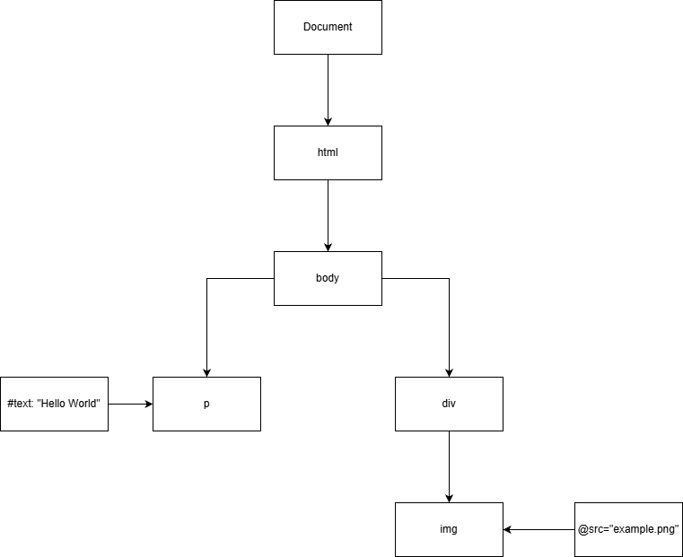
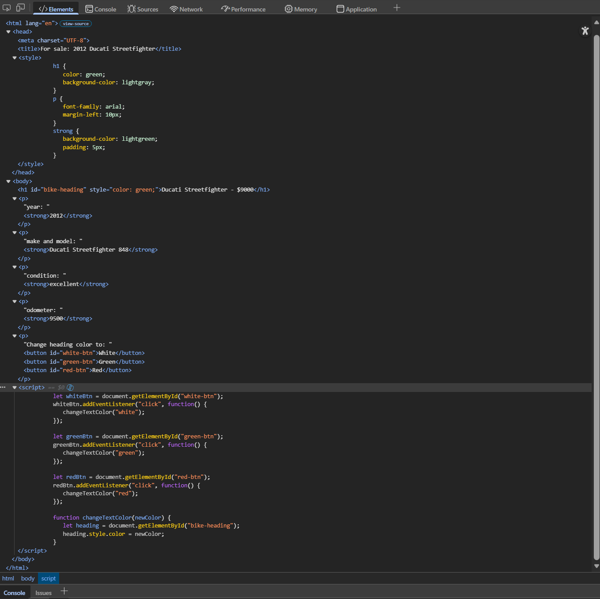

# In-Class Activity 7-2

## HTML -> DOM

    \<html>

        \<body>

            \
Hello World

            \
\\

        \</body>

    \</html>

<a href="DOM.html">Open DOM.html here</a>

<a href="DOM.drawio">Open DOM.drawio here</a>

<a href="DOM.svg">Open DOM.svg here</a>

## DOM Tree Concepts

1. Use the Developer Tools to display the DOM representation of the In-Class Activities 4 HTML "motor.html" (using the "Elements" panel). Expand all elements and create a screenshot of the DOM representation. Then answer the following questions.

2. What elements are the descendants of "head"?

    ><code>meta</code>, <code>title</code>, <code>style</code> are all the descendants of "**head**".

3. Which element is the 5th child of "body"?

    >The 5th child of "**body**" is the \
 element containing <code>odometer: 9500</code>.

4. What elements are the siblings of the "h1" element?

    >The siblings of the "**h1**" element are all the other children of "**body**". Siblings are: \
 (<code>year</code>), \
 (<code>make/model</code>), \
 (<code>condition</code>), \
 (<code>odometer</code>), \
 (<code>buttons</code>), and \<script>.

5. What is the "text content" of the first "p" element?

    >The text content of the first \
 element is <code>**year: 2012**</code>.

6. Which nodes are the children of the first "p" element?

    >The text node is "**year:** ", and the element node is \<strong>, and the text node inside \<strong> is "**2012**".

7. Which elements are the child elements of the first "p" element?

    >Only one element child: \<strong>.