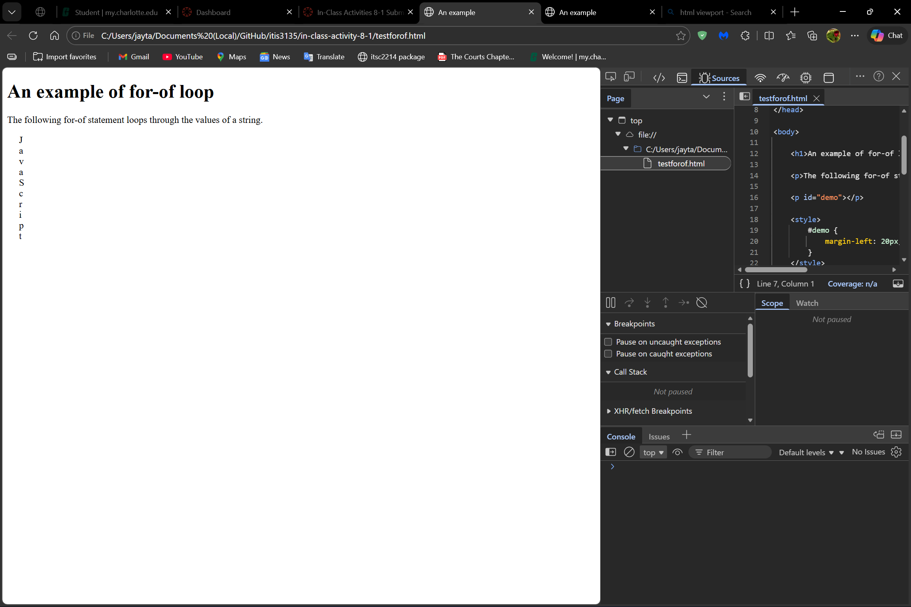
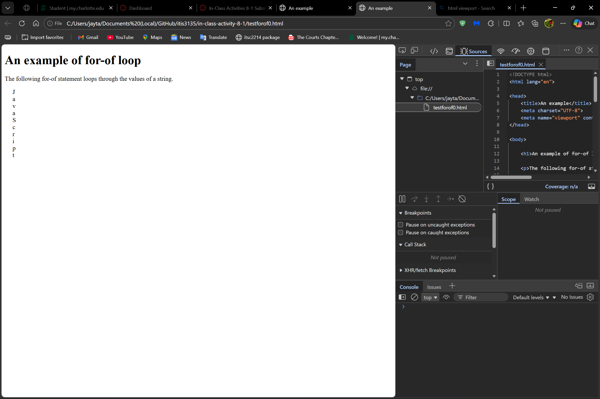
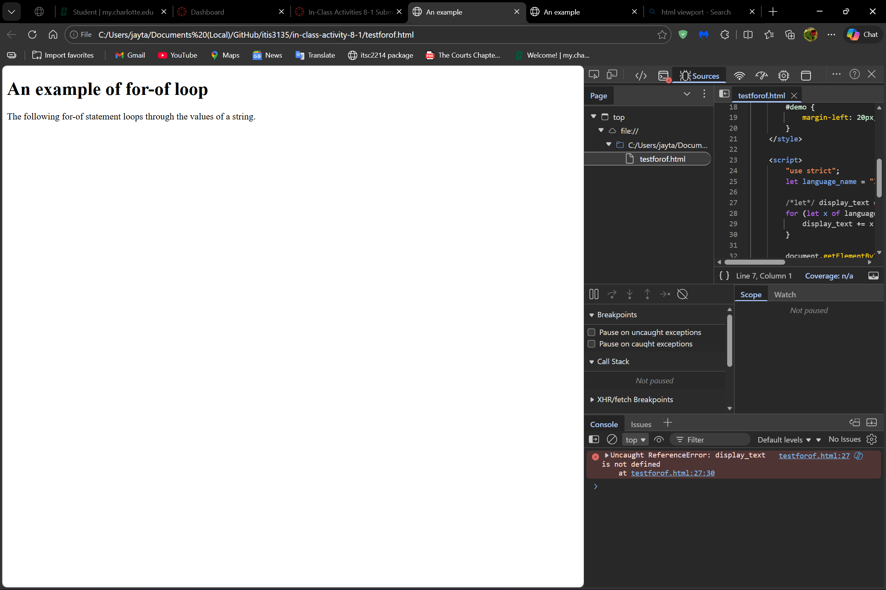
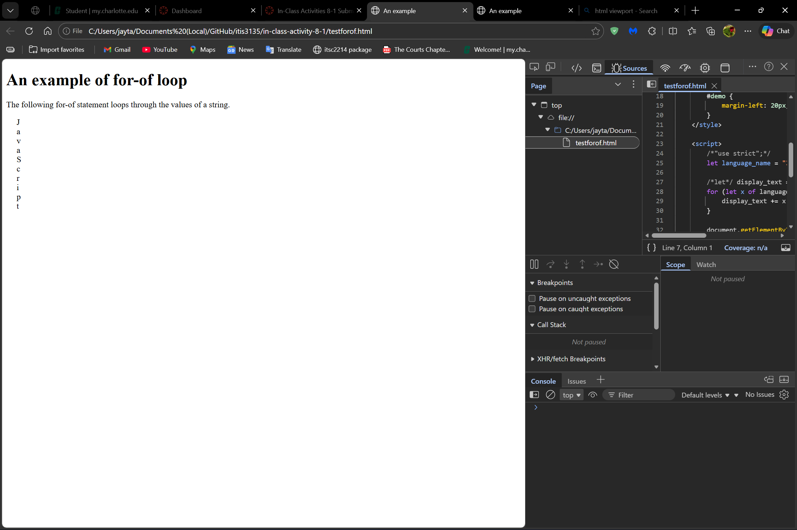
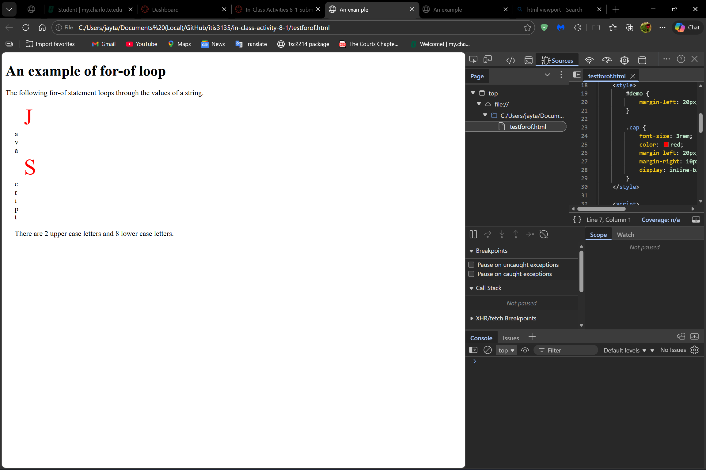
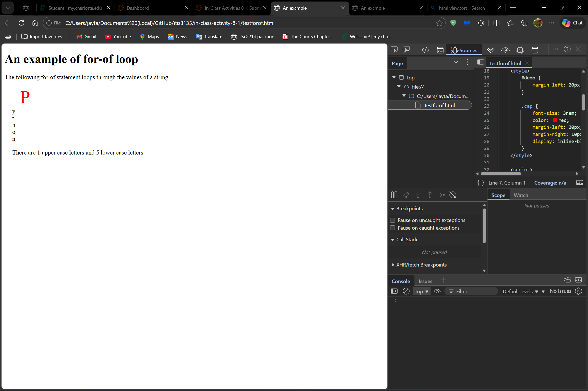

# In-Class Activity 8-1

## Instructions

Download testforof.zip from Canvas, unzip and load both files into editor. Display both apps and examine the codes.

## Part 1

1. What are the differences between the two files?

    >The first file writes the output into the existing \
 using innerHTML, so the text appears inside the paragraph and respects its CSS, while the second file places the \<script> inside the \
 and uses document.writeln(), which writes **outside the paragraph**, breaking the HTML structure and ignoring the paragraph’s styling.

2. Now examine testforof.html, in line 25 remove "let". Save and then reload the page. What do you observe? (hint: Developer Tools)

    >When examining the *Developer Tools* I noticed that the console states that there exist an "*Uncaught ReferenceError: display_text*". This leads to the script to stop functioning and the printed "*JavaScript*" (with the letters seperated by line breaks) is no longer being displayed.

3. Now remove Line 22, save and reload the page. What do you observe?

    >After removing line 22, the script's began to resume functions and the printed *JavaScript*" was displayed again.

**Restore the original code and make sure that it works properly!**

## Part 2

4. Change styles as shown in the figure. Display the capital letters with large sizes (3rem). Display the capital letters in red. Indent the capital letters and add more spacesbetween the capital letters and lowercase letters.

5. Display at the bottom the text "There are N1 upper case letters and N2 lower case letters." Replace N1 and N2 with the actual counts.

6. Change the "language name" variable to "Python" and reload the page. Check the results.

**Submit all codes!**