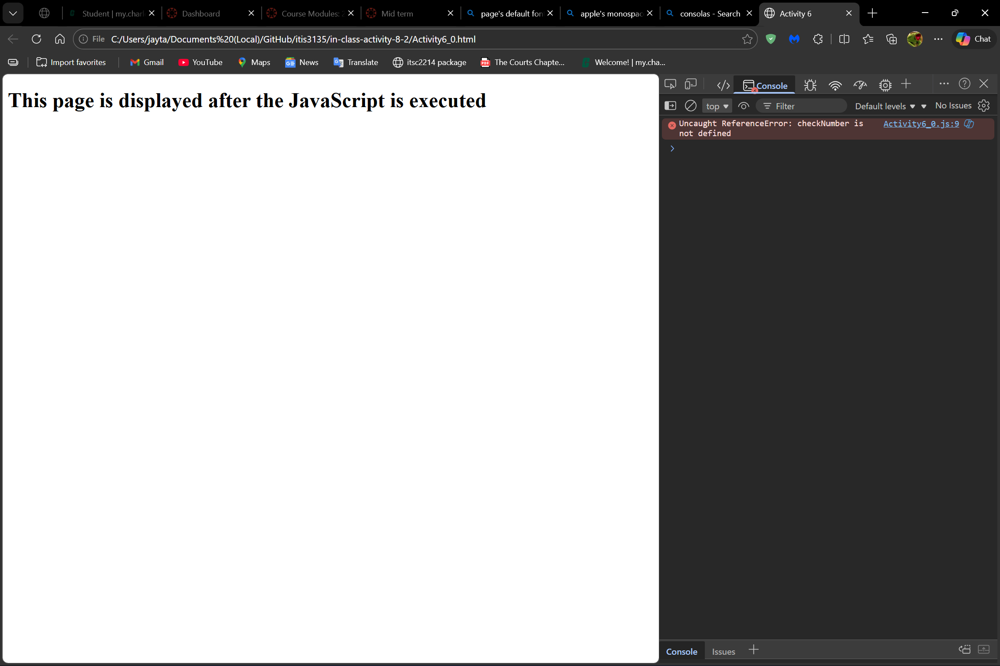
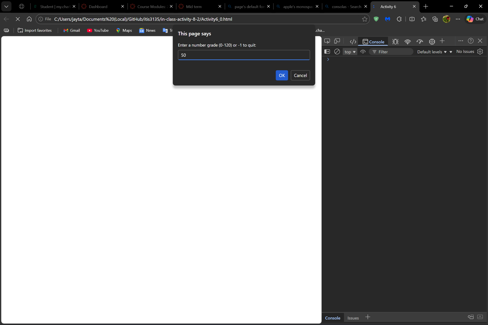
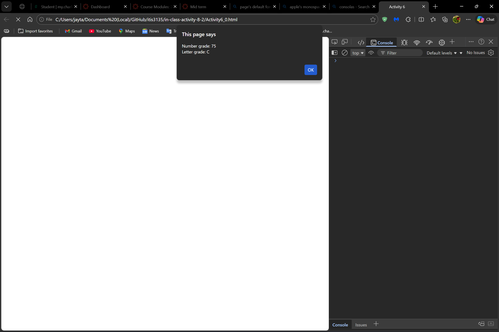
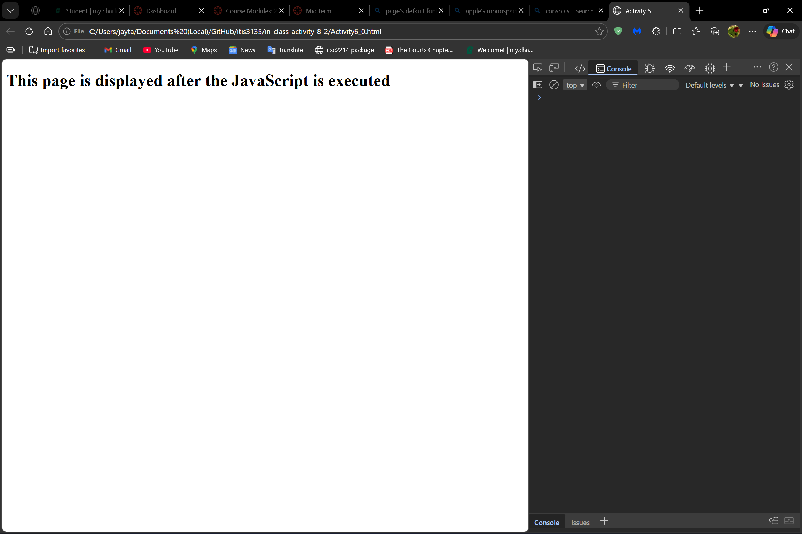
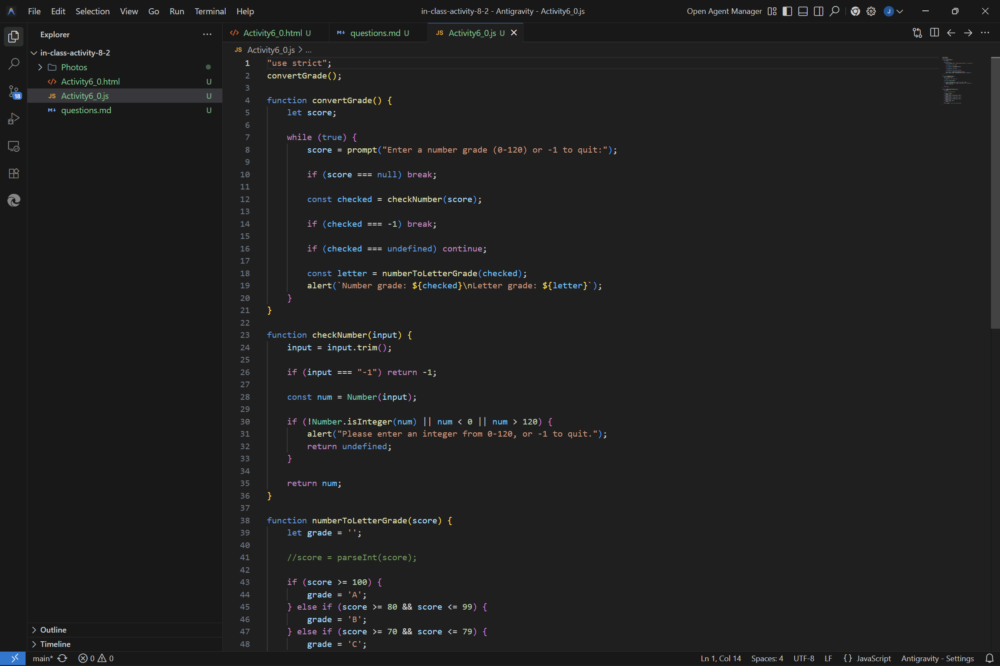

# In-Class Activity 8-2

This application should display a prompt dialog box that gets a number grade from 0 through 120. Then, it should display an alert dialog box that displays the letter grade for that number. To derive the letter grade, you should use this table: 

* A 100-120, B 80-99, C 70-79, D 60-69, F < 60

The app should continue until the user enters "-1".

## Instructions

Download the Activity6_0.zip on Canvas.

1. Test the current app, note it currently doesn't work, why?

**Answer:**

> The original version didn't work because the checkNumber always returned true, which is why any invalid input was never caught. The score was a **string**, so comparisons like score >= 100 were incorrect. Also, they existed no loop, so the app would only run once.

2. Fix the error(s) and test the app.

**Answer:**

> To fix the erros I added a numeric conversion and validation, and I added a loop so the program would continue unless the user inputs -1.

3. Complete checkNumber function to make sure the entry is a valid number from 0 through 120.

**Answer:**

> I completed the checkNumber by adding a validator to check if the user's input is in fact an integer, is between 0 and 120, and will allow -1 as a sentinel. Then, it will return num if the user's input is in fact valid, it will return undefined if the user's input is not valid, or it will return -1 to quit the app.

4. Fix the code to ensure the app continues until "-1".

**Answer:**

> I wrapped everything within a while(true) loop, and set a break for when checked === -1.

5. Add "use strict"; and fix issues until the app works again.

**Answer:**

> I have added the use strict so that I could declare variables (let, const) and to prevent any accidental globals.

